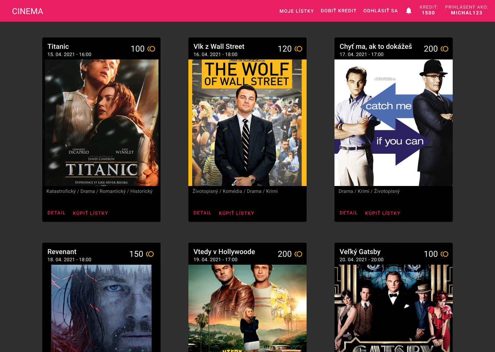
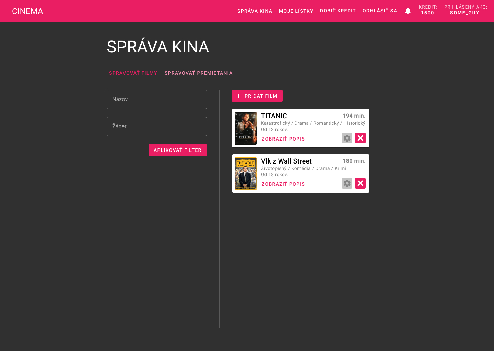

# Cinema App

A ticketing system for a cinema.

Created as a school project all by myself, design, frontend and backend.

Firebase backend is no longer active so it is not currently possible to test this app with a backend.

See `/preview` for demonstration photos and video (sorry app is in Slovak language).

## Tech stack

- Angular
- Material UI
- Firebase

## Features

Accounts

- Users can register, log in and log out.

Movies

- Admin can add new movies.
- Admin can remove a movie.
- Movie has a title, genres, length, minimal viewer age and description.

Screenings

- Users can browse the listed movie screenings and can open movie detail.
- Admin can create a new movie screening.
- Admin can cancel a screening, but he has to provide a reason. After cancelling, users with tickets will get a notification with the reason.
- Screening has a date and time and a ticket fee.

Credit

- Users have a credit on their account which they use to buy tickets to movies.
- Credit can be "bought" by swiping an imaginary card.

Buying tickets

- User can buy a ticket for himself or for more viewers.
- User can fill in individual viewers, pick their seats and delete existing viewers.
- User can buy tickets for all viewers by paying the fee from the credit.

## Setup

Requirements

- Node 12

Set-up

- `npm install`
- `npm start`
- App is now available at `localhost:4200`.
